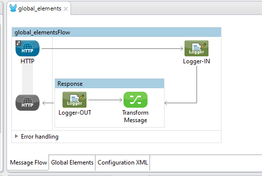
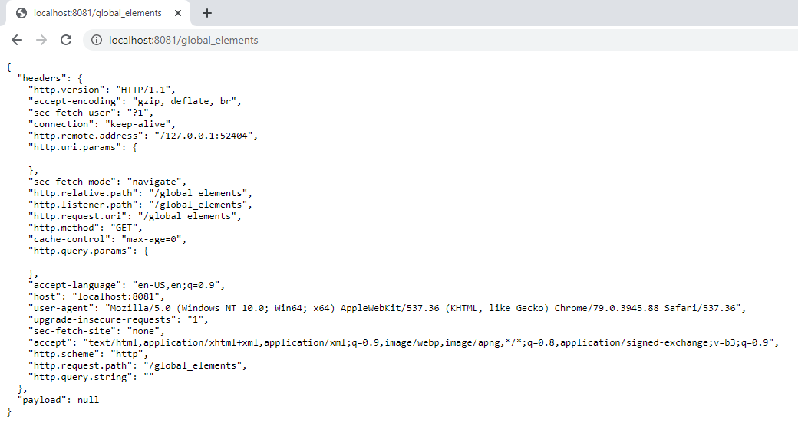

Demo 1   
	site: https://code2blog.wordpress.com/2020/01/16/mulesoft-part-12-scheduler/   
   
This message flow (code2blog_poll.xml) scans or polls a folder in some interval and logs names of files in it.  

- - - - - - - - - - - - - - - - - - - - - - - - - - - - - - 

Demo 2   
	site: na   
	 
This message flow (global_elements.xml) is my attempt at defining some standards around multiple flows in one project   
You can invoke it using this url http://localhost:8081/glbal_elements   
<pre>
I have chosen to retain all my global configurations in one file for easy maintenance 
-	With one global configuration file, you can copy the settings to a new project without conflict 
-	Similarly you can have multiple flows under one project that share this global-settings

Name for this global configuration file is chosen as global_elements.xml
I have added few components to this flow to serve as a simple hello-world test. It accepts http-get request and responds with json output. Request and response are logged. 

</pre>

<pre>
Both request and response are logged in this format. We will go through why I have chosen this template on a later day. 
{loggerUid=Logger-IN, messageFlow=global_elements, inboundProperties=#[message.inboundProperties], payload=#[payload] }	
{loggerUid=Logger-OUT, messageFlow=global_elements, inboundProperties=#[message.inboundProperties], outboundProperties=#[message.outboundProperties], payload=#[payload] }
</pre>

<pre style="font-size:9px">
INFO  2020-01-14 19:05:33,093 [[code2blog_poll].HTTP_Listener_Configuration.worker.01] org.mule.api.processor.LoggerMessageProcessor: {loggerUid=Logger-IN, messageFlow=global_elements, inboundProperties={sec-fetch-mode=navigate, http.request.uri=/global_elements, http.query.string=, sec-fetch-site=none, accept-language=en-US,en;q=0.9, http.query.params=ParameterMap{[]}, http.listener.path=/global_elements, sec-fetch-user=?1, http.remote.address=/127.0.0.1:52915, http.uri.params=ParameterMap{[]}, accept=text/html,application/xhtml+xml,application/xml;q=0.9,image/webp,image/apng,*/*;q=0.8,application/signed-exchange;v=b3;q=0.9, host=localhost:8081, upgrade-insecure-requests=1, connection=keep-alive, cache-control=max-age=0, http.version=HTTP/1.1, http.method=GET, accept-encoding=gzip, deflate, br, http.relative.path=/global_elements, http.scheme=http, http.request.path=/global_elements, user-agent=Mozilla/5.0 (Windows NT 10.0; Win64; x64) AppleWebKit/537.36 (KHTML, like Gecko) Chrome/79.0.3945.88 Safari/537.36}, payload=null }

INFO  2020-01-14 19:05:33,103 [[code2blog_poll].HTTP_Listener_Configuration.worker.01] org.mule.api.processor.LoggerMessageProcessor: {loggerUid=Logger-OUT, messageFlow=global_elements, inboundProperties={sec-fetch-mode=navigate, http.request.uri=/global_elements, http.query.string=, sec-fetch-site=none, accept-language=en-US,en;q=0.9, http.query.params=ParameterMap{[]}, http.listener.path=/global_elements, sec-fetch-user=?1, http.remote.address=/127.0.0.1:52915, http.uri.params=ParameterMap{[]}, accept=text/html,application/xhtml+xml,application/xml;q=0.9,image/webp,image/apng,*/*;q=0.8,application/signed-exchange;v=b3;q=0.9, host=localhost:8081, upgrade-insecure-requests=1, connection=keep-alive, cache-control=max-age=0, http.version=HTTP/1.1, http.method=GET, accept-encoding=gzip, deflate, br, http.relative.path=/global_elements, http.scheme=http, http.request.path=/global_elements, user-agent=Mozilla/5.0 (Windows NT 10.0; Win64; x64) AppleWebKit/537.36 (KHTML, like Gecko) Chrome/79.0.3945.88 Safari/537.36}, outboundProperties={}, payload=null } 
</pre>

<pre>
I have to develop a method to capture bread crumb information into logs when I find time. Here is the simple logic to accomplish it. Each time logger component is invoked, it invokes a function that append loggerUid in global-variable and prints the same to console resulting in bread-crumb that looks like …
Logger-IN --> Logger-SF1 --> Logger-SF2 --> Logger-OUT

</pre>

- - - - - - - - - - - - - - - - - - - - - - - - - - - - - - 
