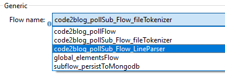

- flow names should be prefixed by filename

INFO  2020-01-17 13:27:48,264 [[code2blog_poll_pn].code2blog_pollFlow.stage1.02] org.mule.api.processor.LoggerMessageProcessor: 

    From this logging entry, you see filename code2blog_poll.xml is present in flow name [code2blog_pollFlow]

[code2blog_poll_pn] is the name of the project. I have appended _pn to avoid confusion with filename code2blog_poll.xml being similar to project name. 

From this picture you see that: if you have filename prepended to flowname, it becomes easier to read.  

Good 
- code2blog_pollFlow
- code2blog_pollSub_Flow_fileTokenizer
- code2blog_pollSub_Flow_LineParser 

Bad
- subflow_persistToMongodb : this resides under code2blog_poll.xml. You cannot know that by its name. This is why it is marked as bad naming convention. 